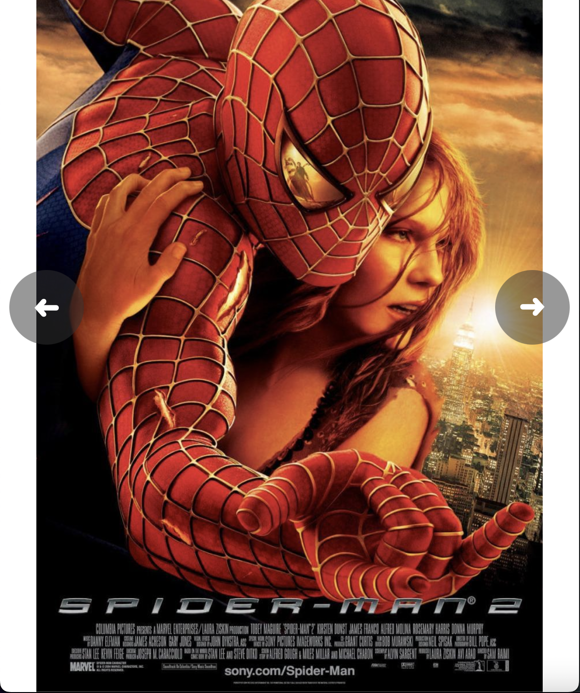

# Gallery

*Galeria de ejemplo con imagenes spiderman*

    - Imagenes incrustadas directo en el html

    - Botones avanzar/retroceder imagen

    - Al llegar a la ultima imagen y seguir avanzando, muestra desde la primer imagen

    - Al llegar a la primera y seguir retrocediendo, muestra la ultima imagen

    - Transiciones en los botones para mostrar que se ha dado click

    - Las imagenes no tienen transiciones al aparecer/desaparecer

    - Adaptable a dispositivos moviles

Puedes ver el resultado [aqui](https://raymundosantorski.github.io/gallery/).

